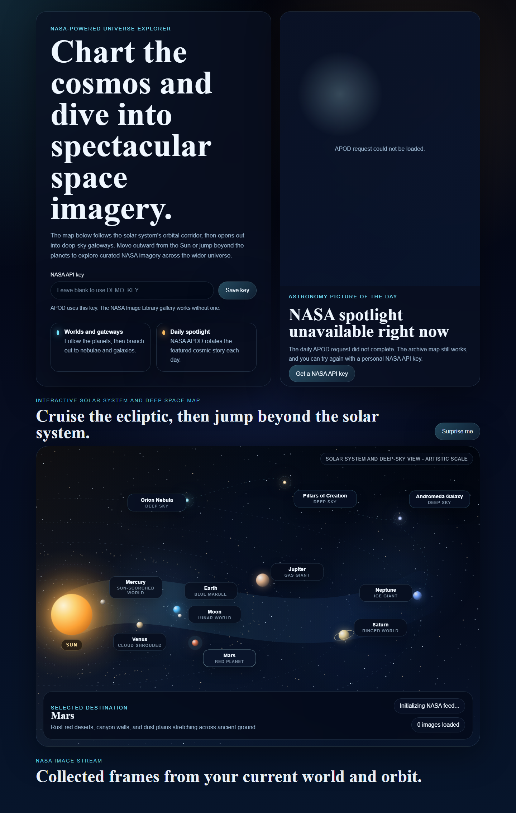
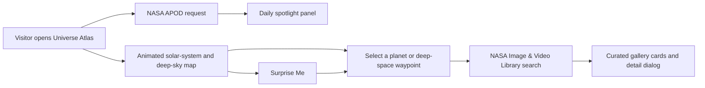

# Universe Atlas

A cinematic, NASA-powered space explorer built with plain HTML, CSS, and JavaScript. The experience opens on a glowing solar-system map, lets visitors move across rotating planetary orbits, then branches into deep-sky gateways like the Orion Nebula, the Pillars of Creation, and Andromeda.

<p align="center">
  
</p>

## Highlights

- Rotating solar-system composition with a starfield canvas stretched across the full map
- Clickable worlds and deep-space destinations that trigger NASA image searches
- NASA APOD spotlight panel for the daily featured astronomy image
- Filtering tuned to favor planets, nebulae, galaxies, and other space imagery over rover-heavy results
- Lightweight static setup with no framework and no build step

## Experience Flow



## NASA APIs Used

| Source | Purpose |
| --- | --- |
| `https://api.nasa.gov/planetary/apod` | Loads the featured Astronomy Picture of the Day panel |
| `https://images-api.nasa.gov/search` | Fetches the destination-specific image gallery |

## Run Locally

```bash
npm start
```

Then open [http://127.0.0.1:3000](http://127.0.0.1:3000).

## API Key Notes

- The app falls back to NASA's `DEMO_KEY` for APOD.
- Visitors can paste their own NASA API key into the interface for better rate limits.
- The NASA Image Library gallery works without an API key.

## Project Structure

```text
.
|-- app.js              # Map logic, NASA requests, gallery rendering, animation
|-- capture-preview.mjs # Local screenshot helper for README visuals
|-- index.html          # App shell and layout
|-- preview.png         # Repository preview image
|-- server.mjs          # Tiny static server for local development
|-- styles.css          # Visual design, map styling, responsive layout
```

## Why This Project Stands Out

Instead of presenting NASA data as a list of links, Universe Atlas treats the solar system like a navigable interface. The map acts as the entry point, the Sun anchors the composition, the planets move through stylized orbits, and deep-space objects extend the experience beyond the edge of the solar system.

## Next Ideas

- Add more destinations such as Uranus, Europa, Titan, and the Carina Nebula
- Offer a timeline or era filter for NASA archive results
- Add keyboard navigation and richer accessibility hints for the map
- Ship a deployed version with a persistent saved destination history
